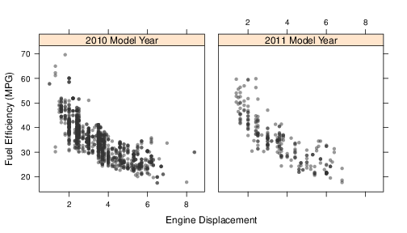
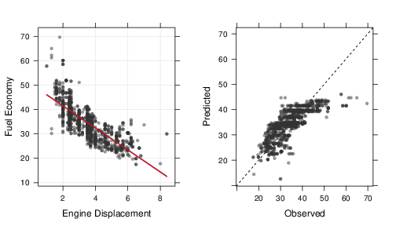
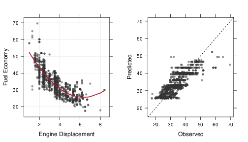
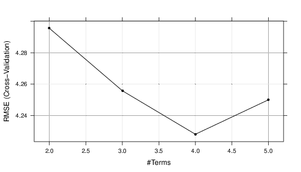
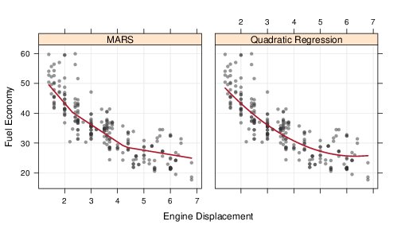

```{r setup, include=FALSE}
knitr::opts_chunk$set(echo = TRUE)
```

# CH02 - Introduction 
This chapter illustrates the model building process in a high level perspective. We will define a problem to show how to create candidate models and selecting the optimal model.

## Case Study: Predicting fuel economy
fueleconomy.gov website show a prediction by fuel economy for passenger cars and trucks. For each kind of vehicle, various characteristics are considered like engine displacement and number of cylinders. Using these values some laboratory measurements are made in high way and city.

In practice we would build a model using as many characteristics as possible in order to find the most predictive model. However the first model will use only one single predictor: "engine displacement" (the volume inside the engine cylinders), and a single response, unadjusted highway MPG $2010$ - $2011$ model year cars.

The first step is to understand the data, it could be done through a graph, for one predictor/target we can use a scatter plot. After that we need to stydy the relationship between the predictors and their distributions this study gives information about the need of a pre processing technique.

The next step is to evaluate a model for the data we split the dataset in two parts: i) trainning the model and ii) evaluate the model. 

After the data split the next step is decide how to measure the performance of the model. For regression problems we tipicaly use the residuals information $y_i - \hat{y_i}$ one possible choise is Root Mean Squared Error (RMSE) wich could be interpreted as: "How far, on average, from the zero are the residuals?"

At this point the modeler uses the trainning data to achieve some great models, just for this models they apply the test set.

Suppose a linear regression was created where the predicted MPG is a basic slope and intercept model. Using the trainning data we estimate using least squares the intercept $50.6$ and the slope $-4.5$ MPG.

The following figure:




shows the relationship between Engine displacement (our only predictor variable) and the target variable (Fuel efficiency). After apply a linear regression model we can draw the following charts:



wich shows the fit of regression in both charts, the left panel shows the regression line with the slope and intercept estimated, the right panel show the predicted x oberved values of target variable. Its a common mistake evaluate the model fit with the same data used to train the model. A good approach could be use ressampling, using different parts of trainning set to train the model, in this chapter we will use the ressampling technique called **10-fold cross-validation** to estimated the model RMSE

According to the figure could be a great idea to add some non linearity at the beginning and the end of the curve, for example adding a squared term to the regression, changing it to  $efficiency = 63.2 - 11.9 \times displacement + 0.94 \times displacement^{2}$

Bellow we can see the new fitted figure:



The issue of quadratic models are the poor performance at extremes of the predictor. One more sophisticated model are multivariate adaptive regression spline (MARS) when used in one predictor it splits the variable data and fit a line for each split, each line has its slope and intercept. MARS has one tunning parameter to be estimated by ressampling

Bellow we can see the tunning parameter estimation using cross-validation:



And in the bellow figure we can see MARS fit using the four terms as tunning parameter:


Based on the three models quadratic regression and MARS where evaluated using the test data set, the following figure shows the relationship and the fit:




## More topics
There are several aspects of model building to be considered they will be approached latter in this book.

### Data Splitting
We will study in the next chapter more ways to split data according to our goals (e.g. model building, evaluate performance). In our example we are interested in extrapolates the data (different trainning and test sample), but its possible to interpolate the data taking a simplen random sample. How the trainning and test sets are choosen reflects how the model will be applied. How much data should be allocated  for each set? Generally depends of the situation. This problem apears when we have small datasets, case when use no test set could be an option.

### Predictor data
When we add more predictor variables more the RMSE will down and as a consequence the performance will be increased.

### Estimating performance
Before use teste set we can use two techniques to determine the effectiveness of the model. The first is quantitative assesment like RMSE and the other are create simpole visualizations of the model observed x predicted to observe where the model underperform

### Evaluating several models
without information about the mdoel there are no best model to be choosed, in our example, according to the charts, the problem is clearly non linear. Using this kind of information we can exclude all linear models from our possible model test suit.

### Model selection
First selection is between models, the linear model was drop because it doesn't fits well. The second choice was between MARS models with different tunning values, in both cases we have used cross-validation to found the best option.


### Summary
We need to understand the data and the objective of modelling to create better models. After this exploratory data analisys (EDA) we pre-process and split the data then finally we build, evaluate and select the best model.
