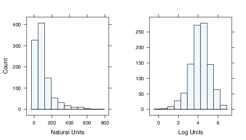

# CH03 - Data Pre-processing
Data Pre-processing refers to add, delete or transform features of the trainning set. Different models have different sensibility of the predictors values, how the predictors enter the model is important. Transformations to reduce skewness or outliers can improve performance, combine two or more predictors, removing predictors without information are some approachs to improve the performance.

The need of pre-processing are determined by the predictor, tree based methods are insensitive for characteristics of predictors. Linear regressions are not, this chapter will cover unsupervised techniques (doesnt consider the outcome to remove variables) to pre-processing. For example Partial Least Square (PLS) is a flavour of supervised PCA.

How the predictors are encoded, called feature engeneering, can have a significant impact in the performance. For example combining predictors or taking the ratio between predictors (this is art not science). There are techniques to encode the data, in the cahpters $12-15$ we will study a dataset to predict academic sucess, one piece of information are submission date of grant it could be represented in many ways:

1. The number of days since a reference date
2. Isolating the month, year and day as separated predictors
3. The numeric day of the year
4. Wheter the date was within the school year (as opposed to holiday or summer sessions)

The 'correct' feature engeneering depends on several factors. Some models handle predictors in different ways, tree based methods for example partition the data in binnings. For some models multiple encoding of the same predictor could make the model underperforming. The second factor is the relation between the predictor and the outcome, if there are seasonal components maybe the day of the year is the best choise, if some months show more sucess rate then the month encoding is the best. The answer is depends on the model and the true relationship with the outcome.

## Case study: Cell Segmentation in high-content screening
we will use a dataset to identify the impact of some medicines in cell shape, development status and number of cells. The dataset contains $2019$ cells, were $1300$ were judge to be poorly segmented (PS) and $719$ were well segmented (WS); $1009$ cells are the trainning set. There are $116$ features for every cell measured to predict the quality of cell segmentation.

## Data transformations for individual predictors
Some modeling techinques require transformations like all predictors in the same scale. Create a good model could be dificult because some outliers. In these chapter we will discuss centering, scalling and skewess transformations.

### Centering and Scalling
To center: Take the average value of the predictor and subtract it from all values as the result the predictor will have a zero mean
To scalle: Each value of predictor is divided by its standard deviation as the result the new standard deviation will be $1$

These manipulations improve numerical stability and PLS benefits from predictors on the same scalle.

### Skewness
We can found rigth and left skewness in the dataset predictors, it could be evaluated using the following statistic:
$$
skewness = \frac{\sum(x_i - \bar{x})^{3}}{(n-1)v^{\frac{3}{2}}}
$$
where 
$$
v = \frac{\sum(x_i - \bar{x})^{2}}{(n-1)}
$$
where the $x$ is the predictor, $n$ is the number of values and $\bar{x}$ is the sample mean. More the distribution skewness to right greater the value of skewness, more the distribution skewned to left smaller the values of skewness.

Simples test to evaluate the degree of skewness are the ratio between the greates over the lower values of the distribution if this value is greater then $20$ then we have a high skewness.

Box and Cox have found a method to empirically identify the an appropriate transofrmation
$$
x^{*} = \begin{cases}
            \frac{x^{\lambda} - 1}{\lambda}, & \text{if}\ \lambda\neq 0 \\
            \log (x), & \text{if}\ \lambda = 0
        \end{cases}
$$

for $\lambda = 2$ square transformation, $\lambda = 0.5$ square root, $\lambda = -1$ inverse and others. Its possible to estimate $\lambda$ usgin the trainning data and maximum likelihood this procedure can be apply to all predictor with values greather than zero.

The upper picture before and after apply a log transoformation over the predictor data.
The bellow picture before and after apply a inverse transformation over the dataset.

## Data transformations for multiple predictors
These transformations act on groups of predictors the most importance are methods to resolve outliers and reduce the dimensionality.

### Resolving outliers
Before remove the outliers we need to ensure they arent special cases of data like clients with high salles. Second we need to ensure they aren't recording errors during data collection step. Some models are resistant to outliers like tre based models. If the model are sensitive to outliers we can apply a spatial sign a procedure wich projects the predictor in a multidimensional sphere, each sample ios divided by its squared norm:
$$
x_{ij}^{*} =  \frac{ x_{ij} }{ \sqrt{ \sum\limits^{P}_{j=1} x_{ij}^{2}}}
$$
this transformation requires center and scaled predictor because the denominator measures the squared distance from the center of distribution.

The following picture shows the data before and after apply spatial sign:

### Data reduction and feature extraction
Data reduction techiniques reduces the number of predictors of the data keeping the majority of information original data. This fewer variables keep the original dataset fidelity, this kind of method wich creates surrogate variables are called *feature extraction* or *signal extraction*. 

Principal components Analisys (PCA) is a linear combination between the predictors knos as principal components (PC) wich captures the most possible variance. The j th PC can be writen as:
$$
PC_j = (a_{j1} \times Predictor1) + (a_{j2} \times Predictor2) + (a_{j3} \times Predictor3) + \ldots + (a_{j4} \times Predictor4)
$$
where $P$ is the number of the predictors, the coefficients $a_{j1},a_{j2},a_{j3},a_{j4}$ are component weigths used to discover the most important predictors to each PC. The following picture shows a dataset before and after apply PCA

