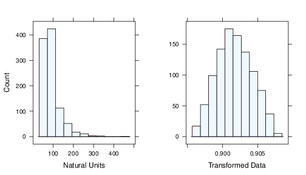
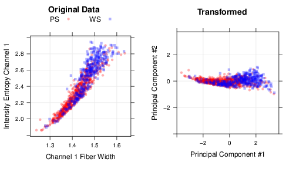
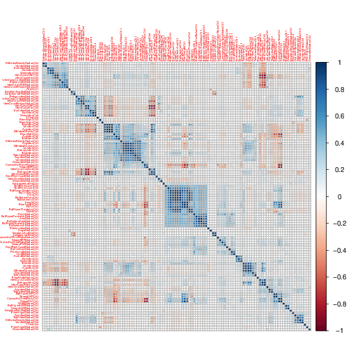

# CH03 - Data Pre-processing
Data Pre-processing refers to add, delete or transform features of the trainning set. Different models have different sensibility of the predictors values, how the predictors enter the model is important. Transformations to reduce skewness or outliers can improve performance, combine two or more predictors, removing predictors without information are some approachs to improve the performance.

The need of pre-processing are determined by the predictor, tree based methods are insensitive for characteristics of predictors. Linear regressions are not, this chapter will cover unsupervised techniques (doesnt consider the outcome to remove variables) to pre-processing. For example Partial Least Square (PLS) is a flavour of supervised PCA.

How the predictors are encoded, called feature engeneering, can have a significant impact in the performance. For example combining predictors or taking the ratio between predictors (this is art not science). There are techniques to encode the data, in the cahpters $12-15$ we will study a dataset to predict academic sucess, one piece of information are submission date of grant it could be represented in many ways:

1. The number of days since a reference date
2. Isolating the month, year and day as separated predictors
3. The numeric day of the year
4. Wheter the date was within the school year (as opposed to holiday or summer sessions)

The 'correct' feature engeneering depends on several factors. Some models handle predictors in different ways, tree based methods for example partition the data in binnings. For some models multiple encoding of the same predictor could make the model underperforming. The second factor is the relation between the predictor and the outcome, if there are seasonal components maybe the day of the year is the best choise, if some months show more sucess rate then the month encoding is the best. The answer is depends on the model and the true relationship with the outcome.


## Case study: Cell Segmentation in high-content screening
we will use a dataset to identify the impact of some medicines in cell shape, development status and number of cells. The dataset contains $2019$ cells, were $1300$ were judge to be poorly segmented (PS) and $719$ were well segmented (WS); $1009$ cells are the trainning set. There are $116$ features for every cell measured to predict the quality of cell segmentation.


## Data transformations for individual predictors
Some modeling techinques require transformations like all predictors in the same scale. Create a good model could be dificult because some outliers. In these chapter we will discuss centering, scalling and skewess transformations.

### Centering and Scalling
To center: Take the average value of the predictor and subtract it from all values as the result the predictor will have a zero mean
To scalle: Each value of predictor is divided by its standard deviation as the result the new standard deviation will be $1$

These manipulations improve numerical stability and PLS benefits from predictors on the same scalle.

### Skewness
We can found rigth and left skewness in the dataset predictors, it could be evaluated using the following statistic:
$$
skewness = \frac{\sum(x_i - \bar{x})^{3}}{(n-1)v^{\frac{3}{2}}}
$$
where 
$$
v = \frac{\sum(x_i - \bar{x})^{2}}{(n-1)}
$$
where the $x$ is the predictor, $n$ is the number of values and $\bar{x}$ is the sample mean. More the distribution skewness to right greater the value of skewness, more the distribution skewned to left smaller the values of skewness.

Simples test to evaluate the degree of skewness are the ratio between the greates over the lower values of the distribution if this value is greater then $20$ then we have a high skewness.

Box and Cox have found a method to empirically identify the an appropriate transofrmation
$$
x^{*} = \begin{cases}
            \frac{x^{\lambda} - 1}{\lambda}, & \text{if}\ \lambda\neq 0 \\
            \log (x), & \text{if}\ \lambda = 0
        \end{cases}
$$

for $\lambda = 2$ square transformation, $\lambda = 0.5$ square root, $\lambda = -1$ inverse and others. Its possible to estimate $\lambda$ usgin the trainning data and maximum likelihood this procedure can be apply to all predictor with values greather than zero.


The upper picture before and after apply a log transoformation over the predictor data.
The bellow picture before and after apply a inverse transformation over the dataset.



## Data transformations for multiple predictors
These transformations act on groups of predictors the most importance are methods to resolve outliers and reduce the dimensionality.

### Resolving outliers
Before remove the outliers we need to ensure they arent special cases of data like clients with high salles. Second we need to ensure they aren't recording errors during data collection step. Some models are resistant to outliers like tre based models. If the model are sensitive to outliers we can apply a spatial sign a procedure wich projects the predictor in a multidimensional sphere, each sample ios divided by its squared norm:
$$
x_{ij}^{*} =  \frac{ x_{ij} }{ \sqrt{ \sum\limits^{P}_{j=1} x_{ij}^{2}}}
$$
this transformation requires center and scaled predictor because the denominator measures the squared distance from the center of distribution.

The following picture shows the data before and after apply spatial sign:


### Data reduction and feature extraction
Data reduction techiniques reduces the number of predictors of the data keeping the majority of information original data. This fewer variables keep the original dataset fidelity, this kind of method wich creates surrogate variables are called *feature extraction* or *signal extraction*. 

Principal components Analisys (PCA) is a linear combination between the predictors knos as principal components (PC) wich captures the most possible variance. The j th PC can be writen as:
$$
PC_j = (a_{j1} \times Predictor1) + (a_{j2} \times Predictor2) + (a_{j3} \times Predictor3) + \ldots + (a_{j4} \times Predictor4)
$$
where $P$ is the number of the predictors, the coefficients $a_{j1},a_{j2},a_{j3},a_{j4}$ are component weigths used to discover the most important predictors to each PC. The following picture shows a dataset before and after apply PCA



The Figure [PCA] shows two correlated predictors (correl $= 0.93$) these two predictors have redundant information, these predictors or a linear combination of them coukld be use in place of these predictors. In the picture we can see the PCA principal components both uncorrelated, the first PC summarize 97% of all the variation.

PCA look for linear combinations of the predictors that maximize the variability it summarizes the predictors with more variation. You need to scale and centralize the data before apply PCA to avoid misconfusion of magnitude order. Besides that its very usefull to remove the skewness of predictors before apply PCA.

PCA is unsupervised method because it doesnt consider the modeling objective or response variable when summarizing the variability. A supervised approach named PLS considers the target variable.

After the pre-processing stage we can finally apply PCA and decide how many principal components to retain, for that we can use the scree plot as bellow:


The first principal components keep the main variance of the model, analisy the pcs is a important step . To do this, the pcs can ploted against each other and the ploted symbols can be target variables. Some care should be taken while plot this kind of chart whit the scale of values of each component, the last components keep the less amount of variance.

The next figure shows PC against other PC, the colored symbols are the classes.


The percentages of variance are not large for the three first components then we cant over interpret the chart. The plot shows some separation between classes using the PC1 and PC2 but its not true. These chart show the data is not easily separated.

Another use of PCA is to identify which predictors are associated with each PC, each component is a linear combination of the predictors the coefficients are called *loading*. Loadings close to zero means there are small contribution to the predictor for the PC, the following figure shows the loadings for the first three PC.


That figure shows to us the first channel have great impact on the firt component because the loadings are on the extreme of the PC1, the majority of loadings for the third channel are closed to zero it means the third channel doesnt contribute with the first component. For the PC3 the channel 3 contributes a lot because the loadings are on the extremes.

## Dealing with missing values
Some datasets has missing values there are two main types of missing values: i) structurally missing (number of children a man has given birth to); ii) The value was not determined. The most important is to understand why the values are missing, is the pattern of missing data is related with the output? (informative missingness) this type of missing can introduce significant bias at the model. Like a patient using a new drug with side effects, maybe he will not return at the doctors/scientist to keep the study.

There are censored data tipically found in the lab experiments when the censor cant measure something. The value is lower than the ,limit but we cant measure it preciselly. For inference or interpretation is commom to use a random value, interpolation or mean observed value to fill this data. According to author experience missing values are more concentrated at predictors instead of sample in some cases is possible to remove the predictor with high ocurrence of missing values.

For large datasets removing missing samples are not problem if the missingness is not informative. For smaller datasets removing missing values could be problematic because we can lost some patterns or the model cant learn, there are other possible approachs.

Tree based models can handle missing values or we can impute the missing data ussing another predictor. We build a model with trainning set to fill values of predictors using another predictors. If the number of predictors affected by missing is small a EDA could be done to discover the relationship between the predictors.

Its possible to use PCA to determine if are a strong relationship between the predictors, if a variable has missing values and has strong correlation with another predictor that has few missing values, a focused model can often be effective for imputation (like the example bellow)

KNN could be use as imputation technique a new sample is showed to model to find the closest samples of it and averages the nearby to fill the missing values. The advantages: i) the value will be inside the training data values. Disadvantages: i) entire trainning set are need for each new value; ii) Also, the number of neighboors is a tunning parameter as the method to determine *closeness* of two points.

The bellow figure show two approachs to fill missing data: i) 5NN; ii) linear regression


## Removing predictors
The two main advantages to remove some predictors are: i) less computacional time to process; ii) predictors with high correlation are measuring the same information, removing one will not compromisse the performance and simplifies the model; iii) some models can be affected by degenerated distributions of predictors, remove then can improve then model performance.

Tree models are impervious about this poroblems because they will never use this predictor as a split point on the other hand linear regression can be affected. In both cases the predictor will not add ionfoprmation to the model then its better to remove the variables. Near Zero Variance is one famous approach to that, it means variables with small number of values.

How to find this kind of problem? Simple the number of unique points are small relative to the number of samples. Some scientific languages like R and python has packages of near zero variance.


## Between-Predictor Correlations
Collinearity is when two predictors have a substancial correlation with each other, multiple predictors can suffer from this to (its called multicollinearity). A heat map with correlation can help to visualize the problem, the variables could be grouped using a cluster algorithm to make it easier to see the high correlation areas.

Greater datasets can use PCA to help to measure the magnitude of the problem, if the first PC accounts for a large percentage of variance this implies at least one group of predictors with represent the same information. PCA loadings can be use to find where are this relationships and which variables are inside it.

There are good reasons to avoid data with high correlated predictors, they add more complexity to the model than information they provide, for linear regression usign correlated features can cause unstable  models, numerical errors and degraded predictive performance.

The following picture show a heat map of correlation matrix:



Classical regression techniques uses Variance Inflation Factor (VIF) to identify multicollinearity but it only works for linear models, but it can determine which variables to remove. A more practical approach is remove the minimum number of predictors to ensure all pairwise relations are bellow a certain threshold, the algorithm is:

1 . Calculate the correl matrix
2 . Determine the two predictors with largest absolute pairwise correl (A and B predictors)
3 . Determine the averga correl between A and other variables, do the same for B
4 . If A has a greater correl remove it, otherwise remove B
5 . Repeat steps 2-4 until no absolute correl is greater than threshold

These methods of feature extraction cant guarantee they will find any relation between the predictors and the outcome.


## Adding Predictors
Numerical/Categorical values can be encoded as dummy variables include dummy in models with intercept could reduce the performance. On the other hand to a tree based model this kind of variable could be a great idea to improve the performance.

The following figure show a classic logistic regression and a logistic regression which has added a squared B predictor


There are cases in the literature Fiorina et al (2009) recommend adds complex combination of data to the model, for classification they evaluate  *class centroids* the center of the predictor data for each class. Then for each predictor the distance to each class centroid can be calculated and this distances can be added for the model.


## Binning Predictors
The author of the book dont recommend to manual binning the predictors, the advantage of binning is: i) increase the interpretability of the model and the disadvantage are: i) decrease the performance of the model. Some statiscal models can help  the modeler to do that job using statistcal information.

# Computing

Following the code to pre-process the data and remove some features:

```{r computing }

library(AppliedPredictiveModeling)
data(segmentationOriginal)

segData  <-  subset(segmentationOriginal, Case == "Train")

cellId <- segData$Cell
class <- segData$Class
case <- segData$Case

#removing columns
segData  <- segData[, -(1:3)]

#remove status columns
StatusColNum <- grep("Status", names(segData))
segData <- segData[,-StatusColNum]

print(segData)

```

## Transformations

Following the code to identify skewness:

```{r skewnessPreditors}

library("e1071")

# For one predictor
AngleCh1Skewness <-  skewness(segData$AngleCh1)
print(AngleCh1Skewness)

#using apply over all columns
skewnessAll <- apply(segData, 2, skewness)
head(skewnessAll)

# Using lattice to plot the shape and  boxcox to see what kind of transformation could be apply
library("caret")
Ch1AreaTrans <- BoxCoxTrans(segData$AreaCh1)
print(Ch1AreaTrans)

print("The original data")
head(segData$AreaCh1)

print("After transformation")
preditedTransformation <- predict(Ch1AreaTrans, head(segData$AreaCh1))
print(preditedTransformation)

# Now apply PCA over the dataset
pcaObject <- prcomp(segData, 
                    center = TRUE, 
                    scale = TRUE)

# Cumulative variance for each component
percentVariance <- pcaObject$sd^2 / sum(pcaObject$sd^2) * 100
print(percentVariance[1:3])

# Transformed values
print(head(pcaObject$x[,1:5]))

# PCA loadings
print(head(pcaObject$rotation[,1:3]))

# caret package has spatial sign: spatialSign(data) to transform data in sphere
# to input missing values you can use: inpute package like impute.knn or bagged tree
# caret package has preProcess function to: transform, center, scale, boxcox, pca variables, and others
# the predict function applies the results to a dataset

trans <- preProcess(segData, 
                    method = c("BoxCox","center","scale","pca"))

print(trans)

#apply the transformations
transformed <- predict(trans, segData)
print(head(transformed[,1:5]))


```

## Filtering

To filter near zero var its possible to use caret package function: *nearZeroVar*
```{r nearZeroVar}
  
  library(caret)

  #it returns a vector of integers, each integer is a position to be removed from the dataset
  columnsToRemove <- nearZeroVar(segData)
  print(columnsToRemove)

  #To filter the hogh correlated predictors we can use *cor* function
  correlation <- cor(segData)
  print(dim(correlation))
  correlation[1:4, 1:4]
  
  # Show high correlated using an heat map
  library(corrplot)
  corrplot(correlation, order = "hclust")
  
  #To apply a filter based on correl we can use the function: *findCorrelation*
  highCorrel <- findCorrelation(correlation, cutoff = 0.75)
  
  length(highCorrel)
  head(highCorrel)
  
  filteredSegData <- segData[,-highCorrel]
  
```

## Creating dummy variables
There are much approachs to create dummy variables, one is using formula notation of R. Splits of tree based methods can be increased using only dummy variables, to illustrate we will use a subset of *cars* dataset

```{r carsDataset}

data(cars)
type <- c("convertible", "coupe", "hatchback", "sedan", "wagon")
cars$Type <- factor(apply(cars[, 14:18], 1, function(x) type[which(x == 1)]))
carSubset <- cars[sample(1:nrow(cars), 20), c(1, 2, 19)]

head(carSubset)
levels(carSubset$Type)

# To model price as a function of mileage and type we can use 
#dummyVars to find the encodings for the predictors
simpleModel <- dummyVars(~Mileage + Type,
                          data = carSubset,
                          ##Remove the variable name from the column name
                          levelsOnly=TRUE)

print(simpleModel)

# Combining the dummyVars object and predict we can create the dummy variables
predict(simpleModel, head(carSubset))

```

The field type was expanded intpo five categories dummy, the model is simple because we assume the effect of mileage is the same for every type. A more complex model could consider a *joint* effect called interaction

```{r interaction}

withInteraction <- dummyVars(~Mileage + Type + Mileage:Type,
                              data = carSubset,
                              ##Remove the variable name from the column name
                              levelsOnly=TRUE)

predict(withInteraction, head(carSubset))
```

The interaction creates more five variables.


## Exercices

