# CH04 - Over Fitting and model tunning
Modelos atuais conseguem representar quaisquer padrões nos dados, infelizmente eles podem over fitar (representar padrões que não são reproduziveis no decorrer do tempo), para avaliar modelos precisamos de uma metodologia sitemática. Nesse capítulo serão descritas técnicas para garantir um mesmo resultado para modelos no decorrer do tempo e evitar overfit. Nesse capítulo assume-se que os dados são representativos da população e que há uma qualidade mínima na proveniência de dados das amostras.

Com essas condições, nosso objetivo é tunar o modelo sem overfita-lo. Para tal dividimos o conjunto de dados em treino/teste, abordagens mais modernas dividem em vários conjuntos de treino/teste para atingir um resultado melhor do modelo.

###The problem of over-fitting
Técnicas que aprendem muito bem a estrutura dos dados tão bem que ao ser aplicado nos dados onde o modelo foi construído prediz corretamente $100%$ da amostra. Além de aprender os padrões gerais de comportamento dos dados o modelo aprendeu o ruído de cada dado, isso significa que o modelo *overfitou* 

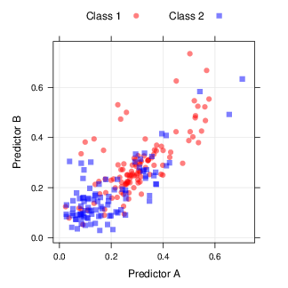

A figura acima, será usada para ilustrar o conceito de over-fitting, contém $208$ exemplos e é um problema de classificação binária, com duas variáveis preditoras. Há um leve desbalanceamento nas classes $111$ classe 1 e $97$ classe 2 além disso existe uma sobreposição de classes, um problema tipicamente encontrado. Um modelo que use esses dados tem tipicamente um objetivo: *predizer novos dados*, o modelo pode ser representado como um fronteira(s) de decisão(ões).

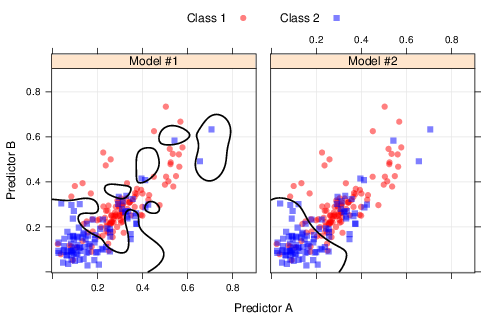

A figura acima mostra dois possíveis modelos para solucionar esse problema, o primeiro separa cada conjunto de dados da classe 1 e alega que o restante seria da classe 2. Podemos perceber que esse padrão não é muito generalizável. O modelo da direita, apresenta uma fronteira de decisão menos rígida que não classifica corretamente todos os pontos, mas tem maior probabilidade de generalizar.

Nesse exmplo simplista, com apenas duas variáveis, é simples observar o over-fitting do modelo da esquerda. No mundo real modelos tem muitas outras variáveis tornando essa abordagem visual impraticável. Necessitamos de uma ferramenta para averiguar o grau de over-fitting.

###Model tunning
Muitos modelos tem parâmetros impossíveis de serem estimados usando os dados, como o KNN, devemos informar o número de vizinhos. Ao escolher muitos vizinhos podemos não conseguir aprender o suficiente dos dados, ao escolher poucos podemos facilmente over-fittar. Esse tipo de parâmetro é conhecido por: *parâmetro de tunning* muitos modelos apresentam pelo menos um desses parâmetros.
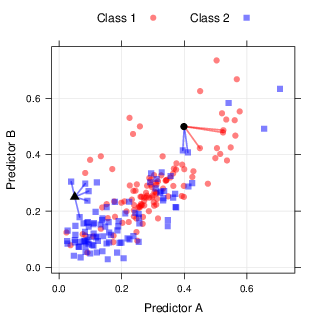

A escolha desses parâmetros aumentam ou reduzem o grau de especialização do modelo, podendo, causar over-fitting. POr exemplo o parâmetro custo do SVM *C* que informa o peso do erro de classificação do modelo, ao setar um valor grande para esse parâmetro, temos um modelo altamente over-fittado enquanto que um valor baixo indica um modelo com resultados baixos. No painel da direita da figura fronteiras de decisão foi escolhido um valor alto, no painel da esquerda foi escolhido um valor usando validação cruzada.

Uma abordagem para escolha de parâmetros é selecionar um subconjunto deles, treinar diversos modelos e observar o melhor entre eles.
Esse processo pode ser visualizado na figura abaixo:
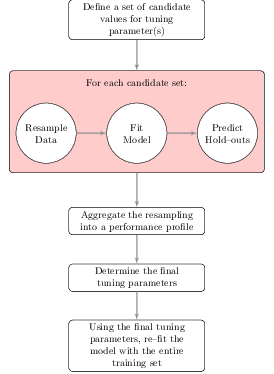


Após selecionar um conjuntto de parâmetros aceitáveis para treinarmos o modelo devemos encontrar uma métrica (confiável) para avaliarmos sua performance. Nesse ponto aplicamos uma estratégia de força bruta nos dados e nos parâmetros para encontrarmos o melhor modelo e parâmetro. Outras abordagens para encontrar os parâmetros ótimo são usar algoritmos genéticos ou métodos de de busca baseados em simplex.

O maior problema é encontrar uma estimativa confiável para esses modelos e definir qual o melhor dentre eles, como vimos anteiormente taxa de erro pode nos levar a uma falsa sensação de segurança. Uma abordagem usada é testar o modelo para uma amostra não usada para treinar o mesmo, seu tamanho deve ser considerável.

Uma outra abordagem é usar um conjunto apenas de teste reamostrando o conjunto de treinamento, para realizar isso existem algumas técnicas estatísticas que serão abordadas adiante.


###Divisão de dados
O coração do processo para encontrar os parâmetros ótimo é a divisão do conjunto de dados, a construção do modelo segue os seguintes passos:

1. Pré-processamento dos preditores
2. Estimação dos parâmetros
3. Seleção de preditores
4. Avaliação da performance
5. Ajuste fino das regras de classificação (tipicamente usando curvas ROC)

Dado que há um conjunto fixo de pontos de amostra, o modelador deve decidir como distribui-los nessas etapas. A principal escolha são os pontos que serão usados para avaliar o modelo, idealmente não devem ser os mesmos usados para treinar/ajustar finamente o modelo, dessa forma, eles representam valores não viesados. Quando há um conjunto de dados grande e expressivo podemos separar os conjuntos em validação e teste sem problemas, usando um para *treinar* e outro para *validar*.

Quando não há um conjunto de dados grande o suficiente não fazemos um conjunto de validação pois cada instância deve ser usada para treinar o modelo. Além disso o conjunto de teste que seria usado pode não ter poder preditivo suficiente para tomar deciões precisas. Muitos pesquisadores reportaram que usar apenas um conjunto de dados é uma decisão pobre em termos de performance. Usar a validação cruzada é uma alternativa melhor e viável.

Se um conjunto de teste é estritamente necessário podemos tomar algumas ações:

1. Podemos treinar o modelo com um conjunto e testar em outro
2. No mundo de SPAM de e-mails os mais novos são mais importantes que os mais antigos.

Na maioria dos casos não há desejo em transformar os conjuntos de treino e teste em homogeneos, Amostragens aleatórias podem ser usadas para criar datasets equivalentes.

A forma mais simples para criar conjuntos de treino/teste é tomar amostras aleatórias, não considera informação sobre desbalanceamento entre classes, quando ocorre desbalancemento a distribuição entre classes do output do modelo pode variar muito entre o treino/teste.

Uma alternativa é usar uma amostragem estratificada ao separar os dados, que é uma amostra aleatória aplicada em subgrupos (acredito que aqui seja o upsampling e downsampling)

Os dados  também podem ser divididos entre os valores das variáveis preditoras, uma proposta aceita na literatura é maximizar a dissimilaridade amostral. Há muitas formas para calcular a dissimilaridade amostral a mais comum é usar a distância entre dois pontos de um mesmo preditor, se a distância é pequena os pontos estão próximos, caso contrário estão longe (indicador de dissimilaridade). Para usar esse conceito como ferramenta suponha que o conjunto de teste foi inicializado com apenas uma instância. A dissimilaridade entre esse ponto e os pontos não alocados pode ser calculada. O ponto não alocado com maior dissimilaridade deve ser adicionado ao conjunto de teste. Para adicionar mais pontos será necessário um método para calcular a dissimilaridade entre um ponto e um conjunto, uma abordagem é usar o valor médio de dissimilaridade.

Calcula-se a dissimilaridade média dos pontos adicionados ao conjunto de dados, depois escolhemos o ponto (no conjunto não alocado) com maior dissmilaridade em relação a média de dissimilaridade do conjunto adicionado e adicionamos ele ao conjunto alocado esse processo continua até atingirmos o tamanho do conjunto de teste desejado.

A Figura abaixo mostra esse processo aplicado em um problema de classificação de dados, nesse tipo de problema a técnica de maximização é aplicada dentro de cada classe separadamente, nesse exemplo não foi usada a média entre grupos mas sim o mínimo.

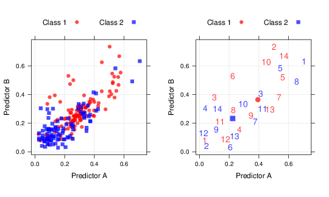

##Técnicas de reamostragem
De uma maneira geral técnicas de reamostragem usadas para avaliar a performance do modelo trabalham de forma parecida. Uma parte dos dados é usada para fitar o modelo e a outra é usada para testar a eficácia dos dados, esse processo é repetido diversas vezes os resultados são sumarizados e agregados. A diferença das tecnicas de reamostragem residem na forma como as subamostras são selecionados.


###k-Fold Cross-validation
As instâncias são divididas em *k* partições com tamanhos aproximados, um modelo é fitado usando 9 partições e testado com a última. Esse processo é repetido 10 vezes trocando a partição de teste por uma que nunca foi usada para teste, na figura abaixo notamos um 3-fold cross-validation:
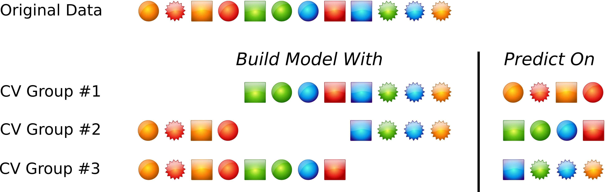
Uma variação dessa estratégia é fazer uma amostragem estratíficada por classes em cada um dos folds. Outra variação, leave one out cross-validation (LOOCV), é um caso especial onde k é igual ao número de instâncias, removemos uma e treinamos com as outras. O modelo final é calculado pela sumarização das k instâncias deixadas de fora uma a uma.

Não há definição formal sobre qual o melhor valor de *k* tipicamente são usados os valores ${5, 10}$ quanto maior o valor de *k* menor o bias da técnica. Com o aumento de *k* a diferença entre conjuntos de treino e teste reduz.

Um ponto importante sobre técnicas de reamostragem é incerteza (variação/ruído), um método sem viés pode predizer o valor correto mas paga um preço alto para isso, *incerteza*. O que significa que repetir o processo de re amostragem pode produzir resultados distintos. Validação cruzada possuí alta variação comparada a outras técnicas, porém para grandes conjuntos de treino essa variância pode ser desprezada.

Valores grandes de k são computacionalmente onerosos, LOOCV é o mais computacionalmente intenso dentre todas as técnicas pois necessita de um modelo distinto para cada ponto e cada subconjunto tem o tamanho da amostra menos um. Tem pesquisas que mostram que o leave one out é tão efetivo quanto uma validação cruzada para $k=10$. Valores pequenos de *k* tem um bias alto mas são menos computacionalmente onerosos, esse bias é quase o mesmo obtido por um bootstrap porém com uma variância muito maior.


###Generalizae Cross-validation
Para modelos lineares de regressão para aproximar o erro do leave-one-out. O generalized Cross-validation (GCV) estatística não exige refitar o modelo para cada subamostra
$$
GCV = \frac{1}{n} \sum_{i=1}^{n}  \frac{y_i - \hat{y_i}}{1 - \frac{df}{n}} 
$$
onde $y_i$ é o i-ésimo rótulo, $\hat{y_i}$ é a i-ésima predição do modelo e $df$ são os graus de liberdade do modelo (parâmetros estimados pelo mesmo) que é uma medida de complexidade para modelos lineares. Dois modelos com a mesma soma de erro quadrado terão diferentes GCV se a complexidade dos modelos forem distintas. Vale ressaltar que é uma fórmula fechada.

###Repeated Training/Test Splits
É conhecido por leave-group-out cross-validation, monte carlo cross-validation, cria muitas divisões dos dados de treino e teste, a proporção de dados para cada subamostra e o número de repetições são controlados pelo analista. Como falamos anteriormente, o bias reduz conforme a quantidade de dados na amostra se aproxima do conjunto de modelagem valores tipicamente usados são: 75% - 80% . A figura abaixo exemplifica esse esquema:
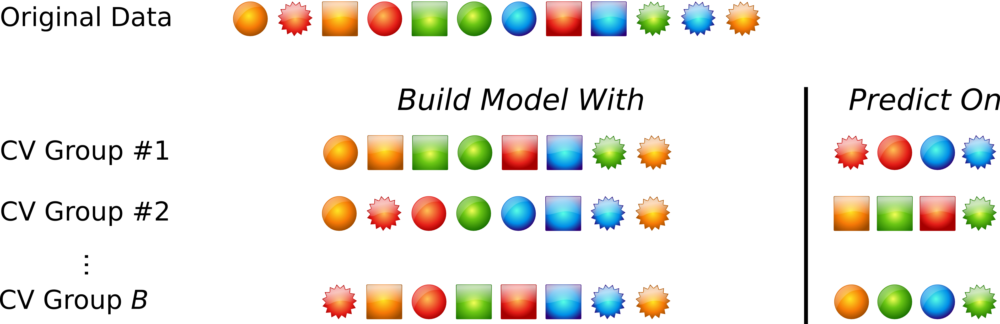

Pode-se observar que a diferença fundamental entre essa estratégia e a validação cruzada é que pode haver repetição de instâncias podem ser representadas em vários grupos deixados para predizer. Além disso o número de repetições aqui tende a ser muito maior que uma validação cruzada.

O número e repetições é importante pois ao aumentarmos ele decrementamos a incerteza do modelo. Para resultados com alta instabilidade 20 repetições seriam suficientes, para obter um score mais estável podemos colocar 50-200 repetições. Esse valor é uma proporção dos exemplos sendo alocados no conjunto de predição, quanto maior a porcentagem  mais repetições serão necessárias para reduzir a incerteza do modelo


###Bootstrap
É uma amostragem com reposição, ou seja, após um ponto ser selecionado para o fold/set ele ainda fica disponível para ser reselecionado novamente. Uma amostra de bootstrap tem o mesmo tamanho do dataset original, como resultado direto alguns pontos serão selecionados mais de uma vez e outros não serão selecionados. Os pontos não selecionados são conhecidos por *out-of-bag*, uma iteração de bootstrap usa os exemplos selecionados para treinar o modelo e os *out-of-bag* para testar. Na figura abaixo podemos ver um exemplo disso:

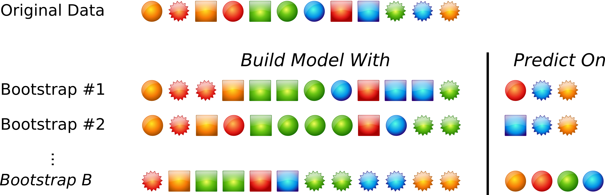

De uma forma geral as taxas de erro de bootstrap tem menos incerteza que um k-fold, entretanto $63.25\%$ dos pontos são representados pelo menos uma vez, portanto essa técnica tem um bias similar ao k-fold para $k=2$. Se o conjunto de treino for pequeno esse bias é grande caso contrário pode ser desprezado.

Alguns métodos foram propostos para reduzir esse bias, um deles é conhecido por **632 method** que é uma combinação de um booststrap simples com uma repredição do conjunto de treino. Por exemplo um modelo de classificação usando esse método seria:
$$
(0.632 \times \textrm{bootstrap estimate}) + (0.368 \times \textrm{apparent error rate})
$$
Esse novo bootstrap reduz o bias mas pode ser instável para amostras pequenas. Essa estimação pode resultar em resultados indevidamente otimistas quando o modelo overfita gravemente. Uma técnica nova foi realizada para ajustar a estimativa de erro do bootstrap denominada **632+method**


###Estudo de caso: Scoragem de crédito
Pode-se aplicar modelos estatísticos para escoragem de crédito. Dados existentes podem ser usados para criar um modelo que prediga se um aplicante à crédito tem bom crédito ou não. Essa informação pode ser usada para definir o risco do banco que está emprestando dinheiro.

German credit data é um dataset muito usado para atividades de ML, contém $1000$ instâncias, rótulos de bom e mal pagador. O dataset é desbalancedo pois $70\%$ são bons pagadores. Se chutassemos todos os exemplos como sendo: **bom pagador** teríamos uma acurácia de $70\%$, portanto o baseline usado de acurácia deve ser no mínimo $70\%$. (Eu discordo dos autores, essa abordagem é viável mas seria mais simples usar um F1 por exemplo)

Alguns preditores são numéricos mas a maioria é categorica, as categoricas foram binarizadas, $800$ instâncias serão usadas para treino e $200$ para teste. O objetivo desse capítulo é ilustrar como tunar um modelo usando reamostragem.


###Encontrando os parâmetros finais
Como escolher o melhor modelo? Uma idéia é pegar o que tiver o melhor score e usar. Um modelo não linear SVM foi fitado para valores de custo entre $2^{-2}$ até $2^{7}$. Cada modelo foi testado com cinco repetições de 10-fold cross-validation as figuras abaixo mostram os valores de acurácia para 

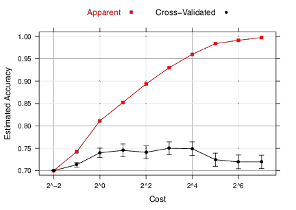


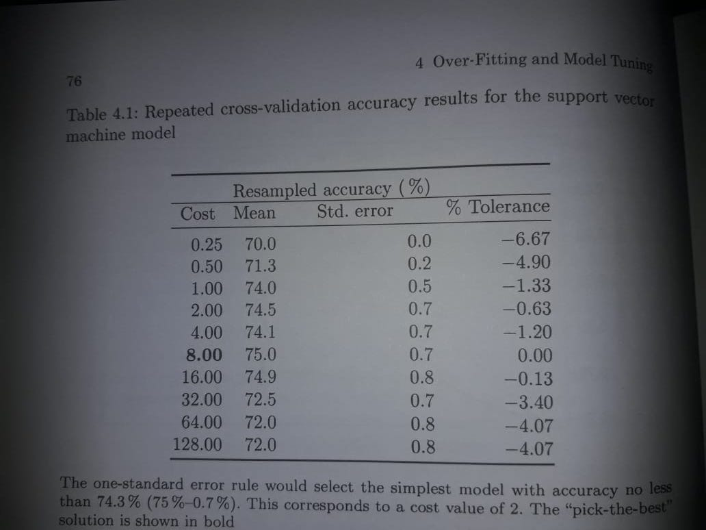

Para cada modelo foram gerados 50 estimativas da acuráciaos pontos vermelhos do gráficos são as médias dessas estimativas as barras são 2 $\pm$ desvios padrão da média do erro. O profile de treinamento mostra um incremento na acurácia até o valor de custo 8 depois disso temos um decréscimo contínuo indicando um overfitting. Perceba que pela acurácia aparente o modelo melhora a medidad que o custo aumenta até 8, depois ocorre um overfitting.

Escolher o ponto de ótimo para o modelo pode não ser um boa idéia dado que são preferíveis modelos mais simples do que os complexos. Uma abordagem diferente é **one-standard error** que encontra o valor de ótimo e ao mesmo tempo seu erro padrão, em seguida procura o modelo mais simples com distância de um erro padrão do melhor valor numérico. Na figura abaixo podemos ver que o valor de acurácia para custo 8 é $0.7\%$
essa técnica encontrará o melhor modelo com acurácia não menos que $74.3%$ ($75\% - 0.7\%$) escolhendo o valor de custo $2$.

Outra abordagem é escolher um modelo mais simples dentro de uma certa tolerância do valor numérico ótimo. O percentual de descréscimo da performance pode ser calculado por $(X-O)/O$ onde $X$ é a performance e $O$ é o valor numérico ótimo. Por exemplo, na figura com o custo do SVM a melhor acurácia de acordo com o profile foi $75\%$ se uma perda de 4 na acurácia for aceitável, como trade off para um modelo mais simples, valores de acurácia maiores que $71.2\%$ poderiam ser aceitos, um valor de custo $1$ poderia ser aceito nesse modelo.

Na figura abaixo foram testados diversos métodos de reamostragem entre eles: 10-fold cross-validation, LOOCV, repeated cross-validation, bootstrap (com e sem ajuste $632$) e repeated training/test split ($20\%$ de held-out). Os últimos dois usando reamostragem de 50 para estimar a performance.

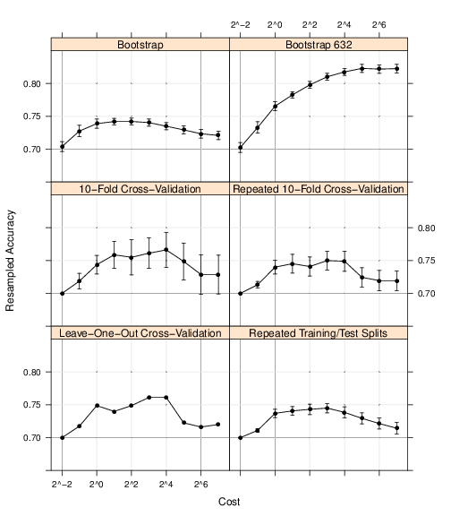

Todas as validações cruzadas apresentam um padrão de ponto ótimo entre $4$ e $16$ seguidos de uma queda de desempenho, muito provável overfitting. Com excessão do bootstrap $632$ todas as técnicas tem um pico, que é atingido rapidamente, seguido pela queda do overfitting. As técnicas de cross-validation tem acurácia entre $74.5\%$ $76.6\%$. O bootstrap simples tem o pior desempenho $74.2\%$ e o bootstrap $632$ super compensa o bias e estima com $82.3\%$ de acurácia.

A largura do erro padrão do 10-fold cross-validation é a maior de todas pois o erro padrão é uma função do número de reamostragens usadas (10 versus as 50 usadas pelo bootstrap). A velocidade de computação o método mais rápido é: 10-fold cross validation, em seguida temos, quase empatados, repeated cross validation, bootstrap e repeated training/test e LOOCV é o mais demorado.


###Data Split recomendações
Pontos negativos em usar um conjunto de teste único e independente:

1 - É uma validação única e não avalia incertezas nos resultados
2 - Proporcionalmente conjuntos de dados grandes aumentam o bias da estimativa de performance
3 - Com conjuntos de dados pequenos:
    3a - O modelo necessitará de todos os pontos para estimar corretamente
    3b - A incerteza do conjunto de teste pode ser conisderavelmente maior dado que conjuntos de teste distintos produzem resultados diferentes
4 - metodos de reamostragem produzem resultados aceitáveis de como o modelo vai performar no futuro

Não existe um método melhor que outro, há diversas situações onde devem ser avaliados os trade-offs. Para conjuntos de dados pequenos é melhor um 10-fold cross-validation pois o bias e variância serão ok e o custo computacional, dado o tamanho da amostra, não será elevado. Se o objetivo é escolher entre modelos em oposição a escolher o melhor indicador de performance, seria recomendável escolher uma técnica de bootstrap pois sua variância é baixa. Para conjuntos de dados grandes a diferença entre métodos se torna irrelevante e escolhemos entre poder computacional tipo um 10-fold cross-validation (discordo do autor, devemos usar um método para obter o melhor modelo mesmo que demore a execução).


###Escolhendo entre modelos
Depois de escolher os parâmetros ótimos para cada modelo, devemos escolher qual o melhor modelo entre todos. Essa tarefa é bem complexa, para tal, devemos seguir o seguinte procedimento:

1 - Começar com modelos complexos como SVM, Boosted tree que produzem resultados ótimos
2 - Usar modelos mais simples e quase interpretáveis MARS, partial least squares, generalized aditive models, naive bayes
3 - Considere usar o modelo mais simples possível dentro da performance esperada (é um trade-off).

Dessa forma, podemos achar o teto de performance e depois ponderar até onde podemos perder de precisão para ganhar em interpretabilidade. No geral a maioria dos modelos tem resultados próximos então podemos escolher de acordo com os benefícios das diferentes metodologias. Complexidade, interpretabilidade, facilidade em predizer. Um SVM e random forest tem acurácia excelente porém suas complexidades computacionais podem impedir de colocarmos eles em produção, se um MARS tiver desempenho levemente inferior podemos usar ele pois tem um tempo de execução muito inferior.

Considerando o exemplode scoragem de crédito onde usamos um SVM com repeated 10-fold cross-validation a acurácia estimada do modelo era de $75\%$ com a maioria dos resultados de reamostragem entre $66\%$ e $82\%$. Usando uma logistica com o mesmo schema de cross-validation obtivemos $74.9\%$ com a maioria dos resultados de reamostragem entre $66\%$ e $82\%$. As mesmas $50$ reamostragens foram usadas para avaliar cada modelo, a figura abaixo mostra a distribuição de ambos

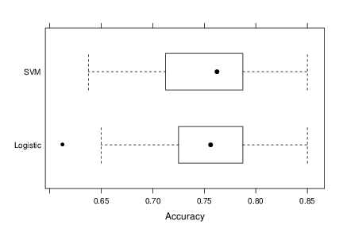

Dado que a acurácia foi metrificada usando o mesmo conjunto de dados reamostrado da mesma forma, estatísticas para comparasão em pares podem ser usadas para determinar se as diferenças entre modelos é estatisticamente significante. Um t-test pareado pode ser usado para comparar se a acurácia (média) dos modelos, ou a diferença média na acurácia dos data sets reamostrados é zero. Para ambos os modelos a diferença média na acurácia dos modelos foi de $0.1\%$ com a logistica tendo resultados melhores. O intervalo de confiança de $95\%$ foi de ($-1.2\%$, $1\%$) indicando que a acurácia de nenhum dos modelos é significantemente melhor. 

Quando são usadas várias metodologias para comparar modelos podemos chegar em situações conflitantes, dependendo do problema a ser tratado devemos considerar o peso de uma estatística maior que de outro. Especificidade e sensitividade podem ser usados para comparar  modelos. Se o conjunto de dados tem mais *eventos* que *não eventos* sensitividade pode ser usado melhor que especificidade. Com aumento de precisão há uma verissimilhança maior que modelos podem ser diferenciados em termos de sensitividade do que especificidade.

###Computação :)

```{r} 
  
  #message = FALSE, warning = FALSE
  library(AppliedPredictiveModeling)
  library(caret)

  data(twoClassData)
  
  #samples to be predicted
  str(predictors)
  
  #outcome classes are in a vector
  str(classes)
  
  #sample method creates random samples
  
  #createPartition creates stratified samples of data
  
  
  #Set the seed
  set.seed(1)
  
  #return a matrix of numbers
  list = FALSE  
  
  trainingRows <- createDataPartition(classes, 
                                      p = 0.8,
                                      list = list)
  
  head(trainingRows)
  
  #subseting objects into training set
  trainPredictors <- predictors[trainingRows, ] 
  trainClasses <- classes[trainingRows]
  
  testPredictors <- predictors[-trainingRows, ] 
  testClasses <- classes[-trainingRows]
  
  str(trainPredictors)
  
  str(testPredictors)
  
  
  #to generate a test set with maximum dissimilarity: maxdissim
  
  #Ressampling: repeated training/teste
  repeatedSplits <- createDataPartition(trainClasses, 
                                        p = 0.80,
                                        #generate multiple splits
                                        time = 3)
  
  str(repeatedSplits)
  
  # bootstraping: createRessamples
  # k-fold crossvalidation: createFolds
  # repeated cross validation: createMultiFolds
  # 
  
  set.seed(2019)
  cvSplits <- createFolds(trainClasses, 
                          k=10, 
                          returnTrain = TRUE)
  
  str(cvSplits)
  
  #get the first set of row numbers from the list
  fold <- cvSplits[[1]]
  
  print(fold)
  
  #To get 90% of the data(the first fold)
  cvPredictors1 <- trainPredictors[fold,]
  csClasses1 <- trainClasses[fold]
  
  nrow(trainPredictors)
  nrow(cvPredictors1)
  
```


#Basic model building in R
Agora temos o conjunto de treino e teste podemos fitar um modelo de knn com 5 vizinhos. Há vários pacotes em R para essa tarfea, MASS, ipred e caret, usaremos o knn3 do pacote caret que produz a probabilidade de classes e a proporção de vizinhos associado a cada classe. Em R podemos usar duas formas para descrever modelos, a notação *fórmula* e a *matricial*. Na notação fórmula o lado esquerdo é a saída do modelo e o lado direito é como os preditores se relacionam para criar a saída, exemplo: modelFunction(price ~ numBedrooms + numBaths + acres, data = housingData) nesse caso como 3 features quantitativas se relacionam para resolver o problema.

A fórmula y~. indica uso de todos as colunas da matriz (com excessão de y) para predizer o output, essa notação é prática permitindo calcular funções dentro da fórmula, como tirar o logaritmo, mas consome muita memória. A interface matricial exige a matriz de dados dentro da função de modelagem, exemplo: modelFunction(x = housingData, y = price). Nem todas as funções em R possuem ambas as interfaces.

Podemos treinar o knn3 da seguinte forma:

```{r}
  trainPredictor <- as.matrix(trainPredictors)
  knnFit <- knn3(x = trainPredictor, y = trainClasses, k = 5)
  
  knnFit
  
```

O objeto knnFit está pronto para predizer novos valores, para tal usamos a função predict

```{r}
  testePredictions <- predict(knnFit, newdata = testPredictors, type= "class")
  
  head(testePredictions)
  str(testePredictions)
```

O valor de type varia de acordo com a função de modelagem.


#Determinação de parâmetros de tunning
Para escolher os parâmetros de tunning usando reamostragem, diversos conjuntos são avaliados usando amostras distintas de dados. Pode-se criar um profile para avaliar o impacto dos parâmetros sobre o desempenho, focaremos aqui no uso do método: *train* do pacote caret que tem suporte a 144 modelos e diversas técnicas de reamostragem.

O SVm treinado anteriormente usou um kernel RBF que possuí o parâmetro $\sigma$ o qual pode ser estimado analiticamente de acordo com algumas pesquisas científicas. O pacote caret faz essa estimativa automaticamente deixando a cargo do analista somente a função custo, a seguir vamos treinar um modelo usando dados de crédito de um banco Alemão.
```{r}
  library(caret)
  data(GermanCredit)
  
  ## First, remove near-zero variance predictors then get rid of a few predictors 
  ## that duplicate values. For example, there are two possible values for the 
  ## housing variable: "Rent", "Own" and "ForFree". So that we don't have linear
  ## dependencies, we get rid of one of the levels (e.g. "ForFree")
  
  GermanCredit <- GermanCredit[, -nearZeroVar(GermanCredit)]
  GermanCredit$CheckingAccountStatus.lt.0 <- NULL
  GermanCredit$SavingsAccountBonds.lt.100 <- NULL
  GermanCredit$EmploymentDuration.lt.1 <- NULL
  GermanCredit$EmploymentDuration.Unemployed <- NULL
  GermanCredit$Personal.Male.Married.Widowed <- NULL
  GermanCredit$Property.Unknown <- NULL
  GermanCredit$Housing.ForFree <- NULL
  
  ## Split the data into training (80%) and test sets (20%)
  set.seed(100)
  inTrain <- createDataPartition(GermanCredit$Class, p = .8)[[1]]
  GermanCreditTrain <- GermanCredit[ inTrain, ]
  GermanCreditTest  <- GermanCredit[-inTrain, ]
  
  set.seed(1056)
  svmFit <- train(Class~., 
                  data=GermanCreditTrain, 
                  
                  #tipo de kernel usado
                  method = "svmRadial",

                  #centralizar e escalar os valores
                  preProc = c("center", "scale"),
                  
                  #usar valores específicos de kernel
                  tuneLength = 10, 
                  
                  #How to ressample the model during the training
                  trControl = trainControl(method = "repeatedcv",
                                           repeats = 5,
                                           classProbs = TRUE)
                  )
  
  svmFit
  
  
```

Podemos plotar o resultado do profile para facilitar a escolha de melhor modelo:
```{r}
  
  plot(svmFit, scale= list(x = list(log = 2)))
```

Para predizer novos valores com essa classe usamos:
```{r}
  
  predictedClasses <- predict(svmFit, GermanCreditTest)
  str(predictedClasses)
  
  predictedProbs <- predict(svmFit, GermanCreditTest, type = "prob")
  str(predictedProbs)
  
  head(predictedProbs)
  
  
```


#Between-model comparison
Vamos comparar uma logistica com o SVM, primeiro vamos treinar a logistica
```{r}

  set.seed(1056)
  logisticaFit <- train(Class~., 
                        data=GermanCreditTrain, 
                        
                        #tipo de kernel usado
                        method = "glm",
                        
                        #How to ressample the model during the training
                        trControl = trainControl(method = "repeatedcv",
                                                 repeats = 5)
                        )
  
  logisticaFit
```

Paara comparar esses dois modelos, dado que ambos foram fitados sobre os mesmos dados reamostrados, podemos usar o método ressample.
```{r}

  ressamp <- resamples(list(SVM = svmFit, Logistic = logisticaFit))
  summary(ressamp)

```

Observamos que as distribuições estão parecidas, a coluna NA é para valores com erros de cálculo numérico. A diferença entre os métodos pode ser visualizada com
```{r}

  modelDifferences <- diff(ressamp)
  summary(modelDifferences)
  
```
O p-valor para a comparação dos modelos é grande $0.592$ para acurácia e $0.269$ para Kappa, mostrando que o modelo falha em mostrar qualquer diferença de performance entre modelos.


#Exercícios


